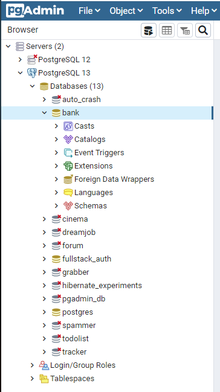
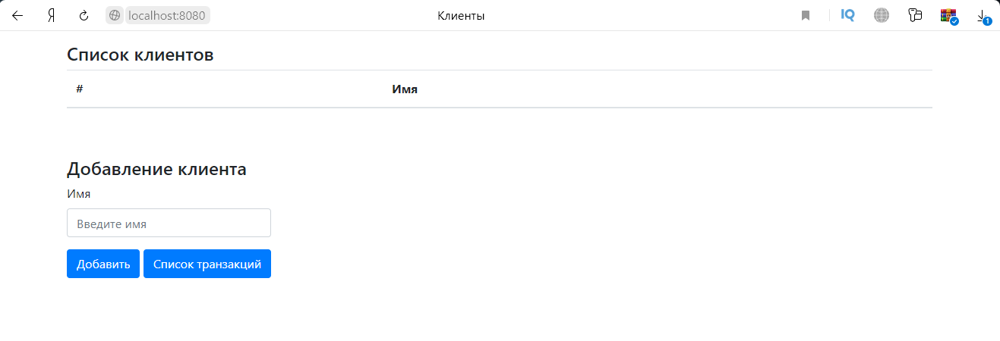

# Проект - Банк
# Содержание
* [Использованные технологии](#Использованные-технологии)
* [Сборка](#Сборка)
* [Использование](#Использование)
* [Контакты](#Контакты)
## Использованные технологии
* Spring Boot
* Spring Core (DI, IoC)
* Spring MVC
* Spring JDBC
* PostgreSQL
* Tomcat
* Collections Framework
* Apache Commons DBCP (Database Connection Pooling)
* JSP
* JSTL
* HTML, Bootstrap
* JS
## Сборка
1. Установить JDK 14.
2. Скачать Maven.
3. Создать переменные окружения JAVA_HOME и M2_HOME и прописать в переменную окружения Path 
пути до бинарных файлов для JDK и для Maven:  
  
4. Установить сервер БД PostgreSQL. При установке задать: 
    * имя пользователя - postgres 
    * пароль - root
    * порт - 5432 
Также при установке сервера БД PostgreSQL нужно установить программу pg_Admin.

5. Скачать исходный код проекта с GitHub.
6. Перейти в корень проекта, где лежит файл pom.xml:  
  
  
7. С помощью Maven осуществить сборку проекта:  
  
При успешной сборке должна появиться папка target, в которой располагается war-архив:  
  
  
  
8. Запустить сервер БД, указав путь до папки data:  
  
9. Запустить программу pg_Admin, установленную вместе с сервером БД PostgreSQL:  
  
10. Создать БД с названием bank:  
  
11. Открыть Query Tool для созданной БД и запустить SQL-скрипт create.sql, 
находящийся в папке src/main/resources/db (папка src находится в корне скачанного проекта):  
  
  
Сборка завершена. Теперь можно проверить работу приложения.
## Использование
Переходим в папку target, где располагается собранный war-архив и запускаем Spring boot приложение:  
  
  
Переходим на главную страницу приложения 
[http://localhost:8080/](http://localhost:8080/):   
  
Основные экраны приложения:  
  
  
  
  
## Контакты
Почта: dmitry_yugay@mail.ru 
Skype: live:.cid.9cdc925fb48220b4